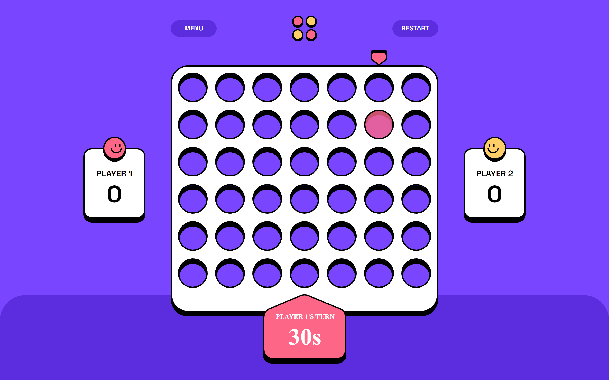

# Frontend Mentor - Connect Four game solution

This is a solution to the [Connect Four game challenge on Frontend Mentor](https://www.frontendmentor.io/challenges/connect-four-game-6G8QVH923s). Frontend Mentor challenges help you improve your coding skills by building realistic projects. 

## Table of contents

- [Overview](#overview)
  - [The challenge](#the-challenge)
  - [Screenshot](#screenshot)
  - [Links](#links)
- [My process](#my-process)
  - [Built with](#built-with)
  - [What I learned](#what-i-learned)
  - [Continued development](#continued-development)
  - [Useful resources](#useful-resources)
- [Author](#author)

## Overview

### The challenge

Users should be able to:

- View the game rules
- Play a game of Connect Four against another human player (alternating turns on the same computer)
- View the optimal layout for the interface depending on their device's screen size
- See hover and focus states for all interactive elements on the page
- **Bonus**: See the discs animate into their position when a move is made
- **Bonus**: Play against the computer

#### Expected behaviour
I made a few changes to improve the gaming experience.

- The initial screen should be the Main Menu.
- Player 1 (red) always goes first. This gives an advantage against the AI, and in PvP mode allows the players to decide on their own who goes first. They could alternate each time, or decide that losing a game makes you go first in the next one.
- When a player wins a round, the win state is shown, and the winning player's score is incremented by 1.
- Each player has 30 seconds to take their turn. When playing against the AI, different difficulties have a different time limit. The counter counts down in real time. If it reaches zero, the player's turn is skipped.
- Clicking the Menu button on the game board opens up the Ingame Menu.
  - Clicking Quit Game from the Ingame Menu navigates to the Main Menu and resets both players' scores to zero.
- Clicking the Restart button on the game board resets the current game but not the players' scores.

### Screenshot



### Links

- Solution URL: [Add solution URL here](https://your-solution-url.com)
- Live Site URL: [https://fem-connect-four-game-mlongobardi.vercel.app/](https://fem-connect-four-game-mlongobardi.vercel.app/)

## My process

### Built with

- Semantic HTML5 markup
- CSS custom properties
- Flexbox
- CSS Grid
- Mobile-first workflow
- [Svelte](https://svelte.dev/) - JS framework
- [Sveltekit](https://kit.svelte.dev/) - Svelte framework
- [Sass](https://sass-lang.com/) - For styles
- [Autoprefixer (PostCSS)](https://github.com/postcss/autoprefixer) - For styles

### What I learned
This has been a quite difficult but fulfilling challenge. I started with the most difficult part: the artificial intelligence for the cpu.
The logic to achieve this can be split into two key components:
- The first component is the minimax algorithm, the one used for these types of 1 vs 1 games with a winner and a loser. It consists of a recursive function that alternates between trying to maximize and minimize (hence the name) the score between each call, simulating the two players that are against each other, and exploring all the possible game states that are reachable in a set number of moves. 

- The second component is the heuristic function, which takes a possible game state and converts it into a score (so that a winning board gives more points than a losing board). The most obvious thing to do is calculate how many "rows" you are about to complete, and give points for that, but I also increased the points given based on how many of your pieces are closer to the center (as those positions make it easier to complete a row). Other small tweaks I included are slightly lowering the score for a vertical row (as I feel it is more easily spottable for a human player), and for rows that will take longer to complete, but it would take a lot of testing with different players to determine the exact values that lead to more wins.

After selecting the end state with the highest possible points, the algorithm chooses the move that brings closer to that end state. It then recalculates every time it's its turn.

This algorithm has an upper bound for its time complexity of O(b^d), where b is the branching factor (the number of possible choices for a move, so 7 on an empty board) and d is the depth (how many moves the algorithm simulates). The exponential scaling means that increasing the depth by a small amount makes quite a big difference in computation time.

After having a working AI, i started trying to improve it as much as I could. 
- The addition of alpha-beta pruning allows to "cut some branches" of the decision tree the algorithm explores (saving computation time), and sorting the array of possible choice for a move in order of their distance from the center makes it more efficient, because center moves have more chances of being the "right" moves.
- Since the score is higher than zero if the AI is winning and lower if it's losing, multiplying the resulting value by 0.9999 at each recursion means that if the AI finds to game states with the same score, it favors the one it can reach in less moves if its winning, or the one that takes more moves if its losing (hoping for a human error that gives it a chance to win).
- The heuristic function takes up most of the computing time (it needs to iterate through all possible "rows" and evaluate them), so I added a cache that keeps the value of previously calculated game boards to avoid repetition. I used a js Map for this, but I made one that deletes half of its oldest values when it reaches its cap of 2^24 to be sure. Each cell has 3 possible states: player 1, player 2 or empty, and with 42 cells that's an upper bound of 3^42 possible game boards. The actual number is lower because, for example, a game board with floating cells isn't possible, but it's still way higher than the Map limit.

**Moving on from the AI, and on to the actual frontend part.**

I started using scss in this project. It was quite convenient to make placeholder classes to have some common css rules I can use in my separate, scoped Svelte components without cluttering html elements with too many classes, as well as having access to things like a for loop inside css.

I rewrote and updated the responsiveness solution I used in my previous project ([here](https://github.com/MLongobardi/FEM-pomodoro-app#what-i-learned)). In summary, it allows to set a minimum and a maximum px value, and the result scales between the two according to screen width:

```scss
.@use "sass:math";

@function minMaxSize($size-at-min, $size-at-max, $min-screen: 375px, $max-screen: 768px) {
    //$size-at-min and $size-at-max should be px, can be negative values and can go from big to small;
    
    @if $min-screen >= $max-screen {
        @error "$max-screen should be higher than $min-screen";
    }
    @if $size-at-min == $size-at-max {
        @return $size-at-min;
    }

	$slope: math.div($size-at-max - $size-at-min, $max-screen - $min-screen);
    $y-intersection: $size-at-min - $min-screen * $slope;
    
    $smallest-size: math.min($size-at-min, $size-at-max);
    $biggest-size: math.max($size-at-min, $size-at-max);
	
	@return #{clamp(#{$smallest-size}, #{$y-intersection} + #{$slope * 100vw}, #{$biggest-size})};
}
```
Now part of the calculation is done at compile time, and I can use it only when it's needed instead of having to apply it to everything with the * selector (or making it into a class). In addition, it can now accept decreasing values.

Here's some more (s)css magic I'm proud of:
```scss
@use "sass:math";
$board-grid-horizontal-padding: 1.25%;

.board-holder {
	--currentCol: 3;
}

@for $i from 0 through 6 {
	.board-holder:has(.column-#{$i}:focus-visible):not(:has(.cell:hover)), .board-holder:has(.column-#{$i}:hover) {
		/*updates marker position on :hover, and also on :focus-visible if no cell is on :hover*/
		--currentCol: #{$i};
	}
}

.marker {
	$step: math.div(100% - 2 * $board-grid-horizontal-padding, 7); //width of a grid cell
	--initial: calc(
		#{math.div($step, 2) + $board-grid-horizontal-padding} - #{math.div(38px, 2)}
	); //38px is the width of the marker
	margin-left: calc(var(--initial) + $step * var(--currentCol));
	transition: margin-left 350ms;
}

:is(.cell:not([disabled]):hover, .board:not(:has(.cell:hover)) .cell:not([disabled]):focus-visible):not(:has(.piece)) {
	/*selects :hover cells, :focus-visible cells when no other one is :hover, but not disabled cells or already occupied cells */
	background: var(--hover-color);
	opacity: 0.8;
}
```
This makes the marker start in the middle of the board, and automatically update its position when hovering on or selecting with tab a cell, exclusively with css. The last part highlights the selected cell.

Lastly, the Dialog.svelte file. This component creates a <dialog> element, with the added functionality of self closing when clicking on the backdrop (but not when clicking on the modal and then dragging on the backdrop or viceversa, even on mobile!). It then uses Svelte's <slot> tag to decide its content, and passes a reference to the <dialog> itself to its parent and its child with component props and binding, so that buttons outside Dialog.svelte there can show or close the dialog.

```html
/*App.svelte*/
<script>
let nextDialog;
</script>
<Dialog let:dialog bind:dialog={nextDialog}>
    <SomeComponent thisDialog={dialog}>
</Dialog>
<button id="dialog-open" on:click={()=>{nextDialog.showModal()}}>Open</button>

/*SomeComponent.svelte*/
<script>
export let thisDialog;
</script>
<button id="dialog-close" on:click={()=>{thisDialog.close()}}>Close</button>
```
Inside SomeComponent, thisDialog is a reference to the <dialog> that contains SomeComponent, use it to call thisDialog.myClose() (after export let thisDialog)
In the component that calls Dialog, nextDialog is a reference to the opened dialog, use it to call nextDialog.myShowModal()

### Continued development
I was thinking of using a store to keeps references to all Dialog.svelte instances, so that I don't have to juggle props and bindings between component trees.

For this project specifically, I could put more work into different difficulty modes, maybe adding a (small) chance for the AI to do a random move. This would add some variety to games and give me a chance to use higher depths for the algorithm I worked hard to optimize, while keeping a balanced difficulty.

### Useful resources
- [Artificial Intelligence at Play — Connect Four (Mini-max algorithm explained)](https://medium.com/analytics-vidhya/artificial-intelligence-at-play-connect-four-minimax-algorithm-explained-3b5fc32e4a4f) - This helped me understand the artificial intelligence logic.
## Author
- GitHub - [@MLongobardi](https://github.com/MLongobardi)
- Frontend Mentor - [@MLongobardi](https://www.frontendmentor.io/profile/MLongobardi)